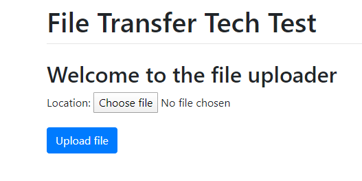
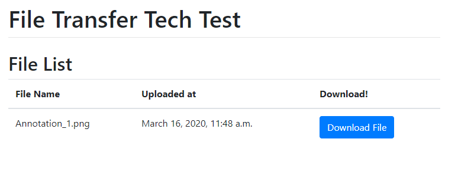

# Tech Test 1
## A file transfer tool built with Django

## About
This is a simple file transfer for uploading and downloading files.
There is not currently a user sign-in; all files uploaded are available to everyone so DO NOT upload sensitive or confidential files to this service.

## Setup
1. Clone this repository and 'cd' into the 'TechTest1' directory created.
1. Run 'python3 manage.py runserver'

## Usage
Usage of this tool is quite straight forward

   1. Navigate to '127.0.0.1:8000' or '127.0.0.1:8000/upload/' in a browser
   
   1. Select the file you wish to upload.
      1. You will be redirected to the 'file_store' page after
   

## Future Steps
   1. Remove the hardcoded value for the 'SECRET_KEY' variable in settings.py and use environmental variables instead
   1. Update the MEDIA_URL and MEDIA_ROOT values to use environmental variables
   1. Change the database engine to postgresql
   1. Separate the database to be hosted on another server
   1. File size checking for files over 100 mb (this would be an operational concern to help prevent overflow of attached storage)
   1. Attach greater bulk storage such as AWS S3 for long term storage of files in large quantities
   1. Add a license file
